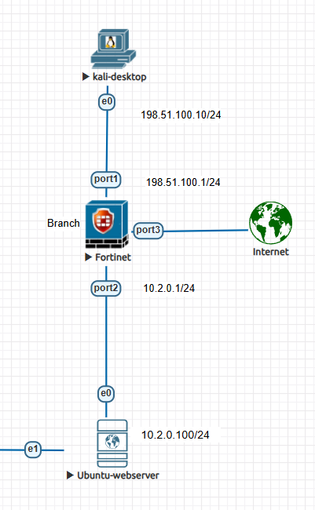
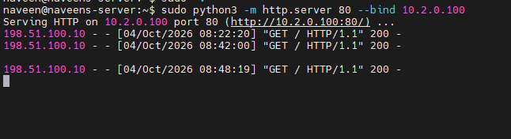
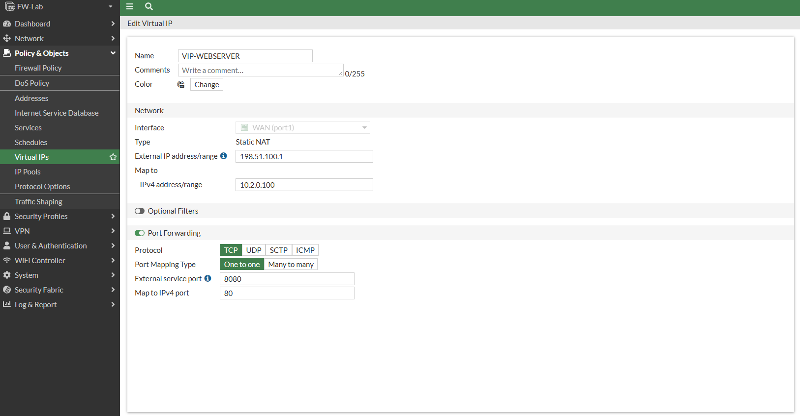
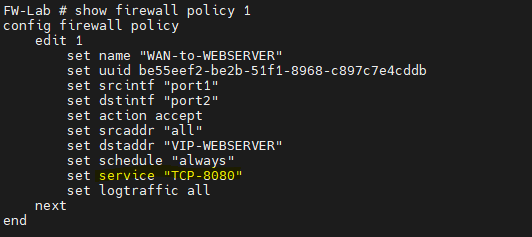
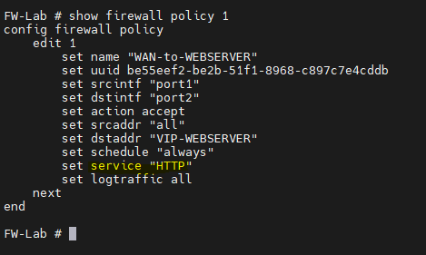
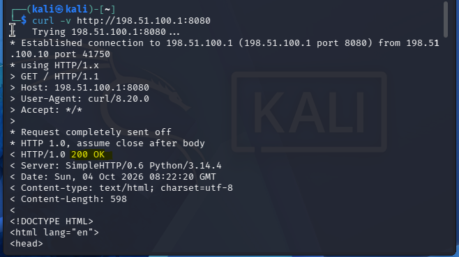
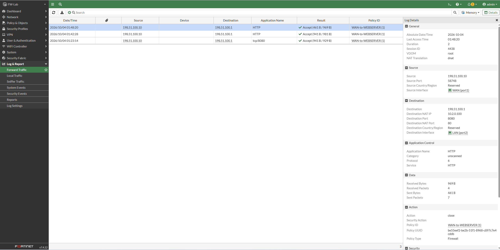
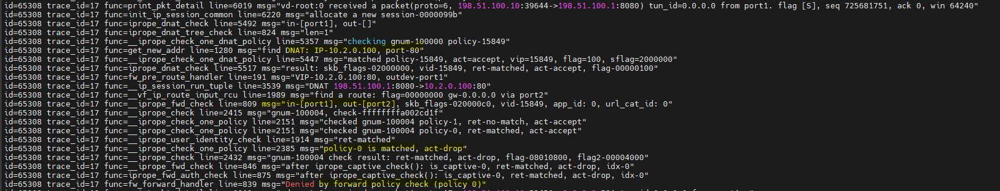
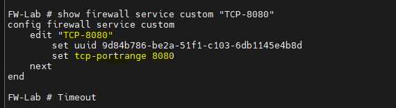
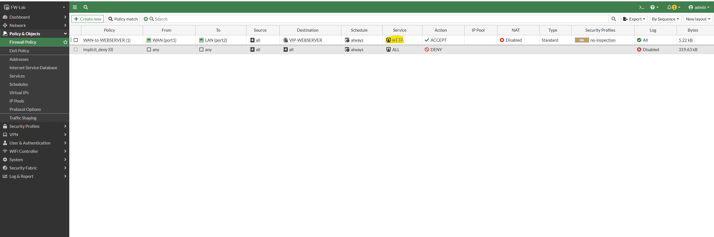

# Day 2 — VIP and DNAT: publish an internal web server

This lab publishes an Ubuntu HTTP server on the outside address of a FortiGate. Clients connect to **198.51.100.1:8080**; the VIP translates that destination to **10.2.0.100:80**.

## Topology



```text
Kali client                         FortiGate                         Ubuntu web server
198.51.100.10/24  ── TCP/8080 ──>  port1: 198.51.100.1/24
                                    VIP: 198.51.100.1:8080             10.2.0.100/24
                                      DNAT to 10.2.0.100:80  ────────> HTTP / TCP/80
                                    port2: 10.2.0.1/24
```

The WAN-facing interface is `port1`; the internal server is reachable through `port2`. Names shown for objects and the policy are the lab names (`VIP-WEBSERVER`, `WEBSERVER`).

## What I did

### 1. Checked the Ubuntu web server on the inside

On Ubuntu, I started Python's simple HTTP server on port 80:

```bash
sudo python3 -m http.server 80
```

I first confirmed the server was responding on the internal network at `10.2.0.100:80`.



Keeping this test separate helped confirm that the web service itself was available before testing the VIP from Kali.

### 2. Created the VIP

I configured a port-forwarding VIP on FortiGate with:

| VIP setting | Value |
| --- | --- |
| External interface | `port1` |
| External IP | `198.51.100.1` |
| External service port | TCP/8080 |
| Mapped IP | `10.2.0.100` |
| Mapped service port | TCP/80 |

The VIP performs destination NAT (DNAT): the client connects to `198.51.100.1:8080`, and FortiGate forwards the translated connection to `10.2.0.100:80`.



### 3. Added the WAN-to-server firewall policy

I created the inbound policy from `port1` to `port2`, using the VIP object as the destination and allowing the traffic. The policy is commonly described in the lab as the **WAN-to-WEBSERVER** policy. The service selection became the key troubleshooting point below.

#### Before



#### After



### 4. Tested from Kali

From Kali (`198.51.100.10/24`), I tested the public side using the VIP's external port:

```bash
curl -v http://198.51.100.1:8080
```

The expected successful result is an HTTP response from the Python server (HTTP 200 in the captured test). This confirms that the outside port is still 8080 for the client.





## Troubleshooting: policy service versus VIP port

At first, the policy used a custom `TCP-8080` service. The request did not pass as expected. I changed the policy service to `ALL`, and the connection worked. That narrowed the issue to policy matching rather than the server, routing, or VIP: the VIP was forwarding the request, but the restrictive service selection did not match the translated traffic as configured.

I used FortiGate debug flow to follow the packet and inspect the drop. The useful things to check in the output are the incoming interface, VIP/DNAT translation, policy match (or lack of one), and the final drop reason. In this run, the debug showed the destination being translated from `198.51.100.1:8080` to `10.2.0.100:80`, followed by the traffic failing to match the intended policy and reaching the implicit deny.

```bash
diagnose debug reset
diagnose debug flow filter clear
diagnose debug flow filter addr 198.51.100.10
diagnose debug flow show function-name enable
diagnose debug flow show iprope enable
diagnose debug enable
diagnose debug flow trace start 10
```




> **Correction to my first explanation:** saying that every firewall policy lookup simply uses the translated port was too broad. The observed result in this lab was that the custom `TCP-8080` policy service failed while `ALL` passed. The reliable way to understand a VIP/policy interaction is to check the actual debug flow and policy configuration for that FortiOS version and traffic path, rather than assume the external port or mapped port without evidence.

After reviewing the port mapping and the policy behavior, I set the policy service to the built-in **HTTP** service and retested successfully. The HTTP service allows TCP/80 for the web server side of this port-forwarding setup.



It does **not** edit the VIP or change the client-facing port. The VIP remains `198.51.100.1:8080 → 10.2.0.100:80`, and Kali still runs:

```bash
curl -v http://198.51.100.1:8080
```

The external port is controlled by the VIP's external service port. The firewall policy's service is a separate setting used to permit the forwarded session. When troubleshooting, verify the VIP mapping, the policy destination/service, and the debug flow together.

## Useful checks

On Ubuntu, start or confirm the listener:

```bash
sudo python3 -m http.server 80
```

On Kali, test the external VIP:

```bash
curl -v http://198.51.100.1:8080
```

On FortiGate, inspect the policy (replace `1` if this lab's policy has another ID):

```text
show firewall policy 1
```

Confirm it references the VIP destination and the intended service (`HTTP` after the correction). Use debug flow when the test fails, and check whether the VIP translation occurs and which policy decision follows. Debug commands vary by FortiOS version; stop any active debug session after collecting the needed output.

## What I learned

- A VIP can expose an internal service on a different external port: here, external TCP/8080 maps to internal TCP/80.
- The client continues to use the external address and port from the VIP even when the mapped port is different.
- A working service with policy service `ALL`, followed by a failed restrictive service, is a useful clue that policy matching needs investigation.
- Debug flow made the translation and policy decision visible and helped locate the failure.
- Don't guess which port the policy will match from the external port alone; verify the actual path and matching behavior.
